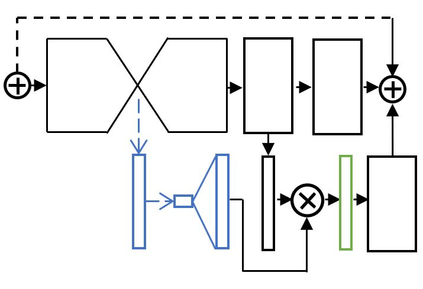
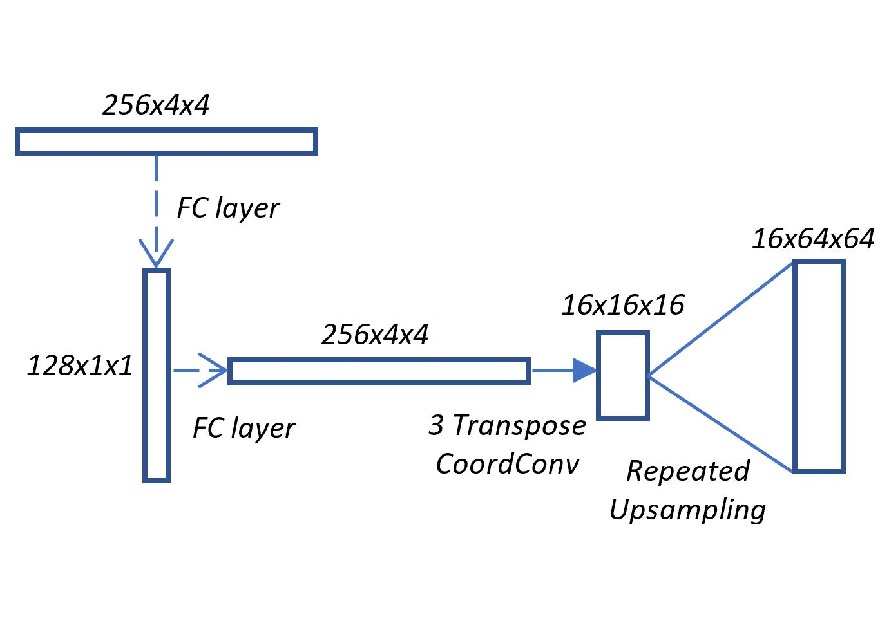

# Hourglass Networks with Top-Down Modulation for Human Pose Estimation

## Overview

[Newell et al.](https://github.com/princeton-vl/pose-hg-train) originally reported 0.881 validation accuracy on MPII. [By using bigger batch size, more training and Adam](https://github.com/princeton-vl/pytorch_stacked-hourglass), we achieved validation accuracies of 0.885 using a 2HG model and 0.901 using an 8HG model. In this implementation, validation accuracies of 0.889 and 0.904 are attained by adding a simple additional bottleneck to decoder network used as attention.

 

## Getting Started

This repository provides everything necessary to train and evaluate a single-person pose estimation model on MPII. If you plan on training your own model from scratch, we highly recommend using multiple GPUs.

Requirements:

- Python 3 (code has been tested on Python 3.6)
- PyTorch (code tested with 0.4)
- CUDA and cuDNN
- Python packages (not exhaustive): opencv-python, tqdm, cffi, h5py, scipy (tested with 1.1.0)

Structure:
- ```data/```: data loading and data augmentation code
- ```models/```: network architecture definitions
- ```task/```: task-specific functions and training configuration
- ```utils/```: image processing code and miscellaneous helper functions
- ```train.py```: code for model training
- ```test.py```: code for model evaluation

#### Dataset
Download the full [MPII Human Pose dataset](http://human-pose.mpi-inf.mpg.de/), and place the images directory in data/MPII/

#### Training and Testing

To train a network, call:

```python train.py -e test_run_001``` (```-e,--exp``` allows you to specify an experiment name)

To continue an experiment where it left off, you can call:

```python train.py -c test_run_001```

All training hyperparameters are defined in ```task/pose.py```, and you can modify ```__config__``` to test different options. It is likely you will have to change the batchsize to accommodate the number of GPUs you have available.

Once a model has been trained, you can evaluate it with:

```python test.py -c test_run_001```

The option "-m n" will automatically stop training after n total iterations (if continuing, would look at total iterations)

#### Pretrained Models

An 8HG pretrained model is available [here](http://www-personal.umich.edu/~cnris/attention_8hg/checkpoint.pth.tar). It should yield validation accuracy of 0.904.

A 2HG pretrained model is available [here](http://www-personal.umich.edu/~cnris/attention_2hg/checkpoint.pth.tar). It should yield validation accuracy of 0.889.

Models should be formatted as exp/<exp_name>/checkpoint.pth.tar

#### Training/Validation split

The train/val split is same as that found in authors' [implementation](https://github.com/princeton-vl/pose-hg-train)

#### Special Thanks

PyTorch code extended from [here](https://github.com/princeton-vl/pytorch_stacked-hourglass). Implemented for a project under advisors Alejandro Newell and Prof. Jia Deng.
